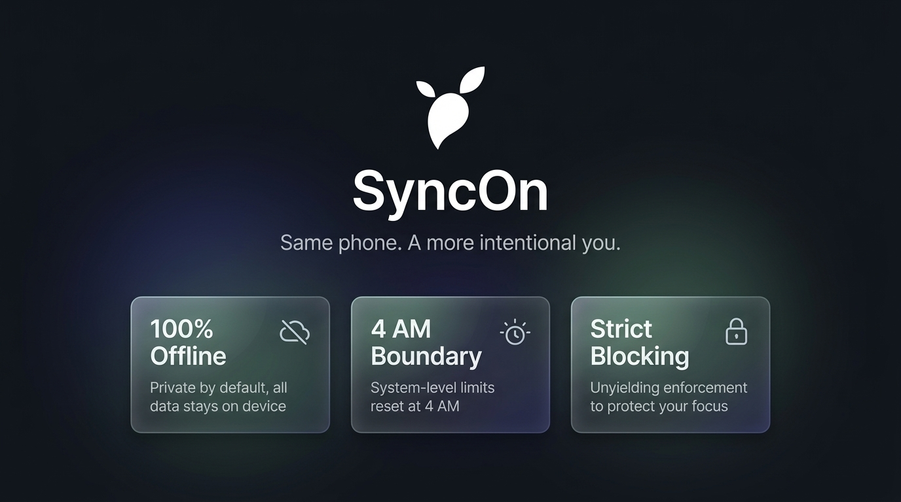
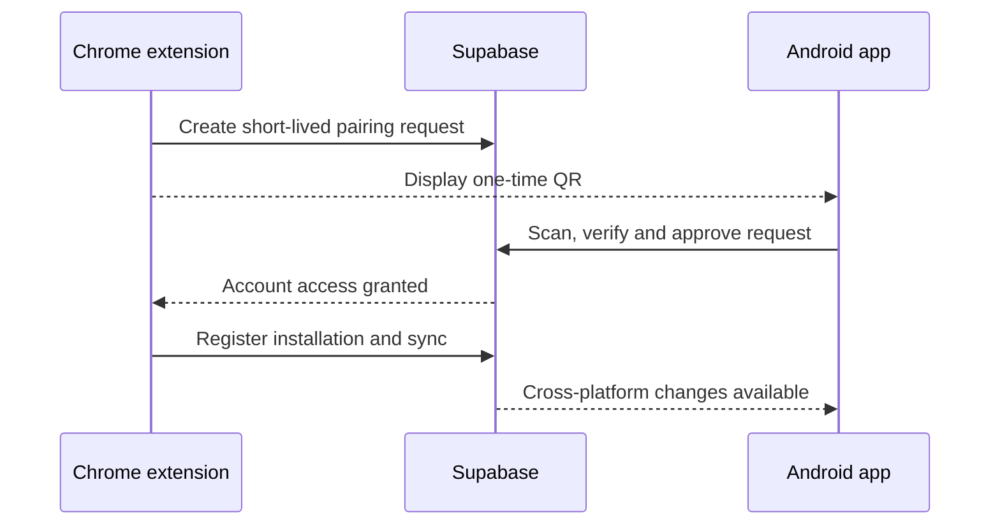
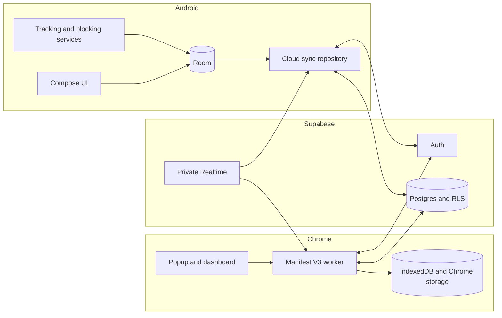

<div align="center">



# SyncOn

[](https://github.com/yushy07/syncon/actions/workflows/checks.yml)
[](https://developer.android.com/)
[](extension/)
[](LICENSE)

**A personal, local-first screen-time system for Android and Chrome.**

Android works independently. The Chrome extension activates only after it is connected to Android with a one-time QR code.

</div>

## Product model

| Component | Can run independently? | Role |
|---|---:|---|
| Android app | Yes | Primary app, Android tracking, limits, trends, account and connected-device control |
| Chrome extension | No, first pairing is required | Focused website tracking, website limits and cross-platform views |
| Supabase | Required for pairing and cross-device sync | Authentication, device membership, synchronization and private Realtime wakeups |

After a browser has been paired successfully, temporary network outages do not stop its local tracking or blocking. Sync resumes when connectivity returns. Revoking the browser from Android locks the extension again.

## Features

### Android

- Foreground application tracking using Android usage events
- Strict blocking and soft limits with configurable snoozes
- App and category budgets
- 4:00 AM to 4:00 AM usage day
- Reboot and process-recovery reconciliation
- All, Android and Chrome dashboard/trend scopes
- Connected-browser management, revocation and cloud-account deletion
- Room database with versioned migrations and local backup support

### Chrome

- Android-required first-run QR activation
- Focused-tab tracking with idle and unfocused-window exclusion
- Domain and category limits with strict or soft blocking
- Native limit warnings, clean-day streaks and 7/14/30-day trends
- IndexedDB interval, cursor, retry and conflict storage
- Manifest V3 service-worker recovery
- Android-matched visual design across popup, dashboard, pairing and block screens

### Connected system

- Account-scoped synchronization protected by Supabase Row Level Security
- Idempotent activity intervals and revision-based incremental pulls
- Explicit setting conflict records and per-record acknowledgements
- Logical service merging such as the YouTube app and `youtube.com`
- Summed device time and overlap-adjusted active digital span
- Private Realtime wakeups with scheduled/manual fallback
- Expiring, single-use QR pairing requests with abuse limits and audit events

## How pairing works



The QR contains a request ID and one-time secret. It does not contain a password, access token or usage history.

## Local installation

SyncOn is maintained as a personal project. Play Store, Chrome Web Store and public-site publication are not required.

### Requirements

- Android Studio with Android SDK 36
- JDK 21
- Android 12 / API 31 or newer
- A Chromium browser with Manifest V3 support
- Node.js 20 or newer for extension checks
- A linked Supabase project when changing or redeploying the backend

### Android

On Windows:

```powershell
.\gradlew.bat testDebugUnitTest
.\gradlew.bat assembleDebug
.\gradlew.bat installDebug
```

The APK is generated under `app/build/outputs/apk/debug/`. On macOS/Linux, use `./gradlew` instead of `.\gradlew.bat`.

Android requires Usage Access for screen-time events and Accessibility access for immediate limit enforcement. The app guides you through these permissions during onboarding.

### Chrome extension

1. Open `chrome://extensions`.
2. Enable **Developer mode**.
3. Select **Load unpacked**.
4. Choose the repository's `extension` folder.
5. The pairing screen opens automatically.
6. In Android, open **Settings → Connected devices → Scan Chrome QR**.
7. Approve the browser and wait for the first sync.

If the extension is already loaded, use **Reload** on `chrome://extensions` after pulling new changes.

## Verification

Android checks:

```powershell
.\gradlew.bat testDebugUnitTest
.\gradlew.bat assembleDebug
```

Extension checks:

```powershell
cd extension
npm test
npm run check
```

Package the extension ZIP locally:

```powershell
powershell -ExecutionPolicy Bypass -File release\package-release.ps1 -Version 1.0.0 -SkipAndroid
```

Generated binaries are intentionally ignored by Git.

## Architecture



Important shared rules live in [`shared/`](shared/):

- [`data-contract-v1.md`](shared/data-contract-v1.md) — synchronized interval and revision model
- [`cross-platform-policy-v1.md`](shared/cross-platform-policy-v1.md) — totals, overlap and conflict rules
- [`service-mappings-v1.json`](shared/service-mappings-v1.json) — Android package/domain mappings

Backend migrations and the callable contract live in [`supabase/`](supabase/).

## Repository layout

```text
syncon/
├── app/                 Android application, Room schemas and tests
├── extension/           Load-unpacked Chrome extension and Node tests
├── supabase/            Database migrations and backend contract
├── shared/              Cross-platform data and product rules
├── assets/              Repository and brand artwork
├── release/             Local packaging and reference documentation
├── docs/                Repository copy of support/privacy information
└── .github/workflows/   Android and extension checks
```

## Privacy and security

- Android stores local usage in Room; Chrome stores paired-browser usage in IndexedDB and extension storage.
- Chrome stores normalized domains, not page paths, query strings, page contents, form data or keystrokes.
- SyncOn has no ads, advertising identifiers or third-party analytics.
- Cloud rows are isolated by account with Row Level Security.
- Pairing secrets are short-lived, single-use and stored by the backend only as hashes.
- Private credentials, keystores, local SDK paths, generated APK/AAB files and extension ZIPs must never be committed.
- Never place a Supabase service-role key in either client. Only the publishable client key belongs in Android or Chrome builds.

See [`release/PRIVACY_POLICY.md`](release/PRIVACY_POLICY.md) for the detailed data description.

## Current verification boundary

Automated Android unit tests, extension tests and static JavaScript checks are included. Real-device checks are still required after environment-sensitive changes, especially QR pairing, Android permissions, process/reboot recovery, Chrome service-worker suspension and offline reconnection.

## License

Licensed under the [Apache License 2.0](LICENSE).

Copyright 2026 Ayush Kant.
