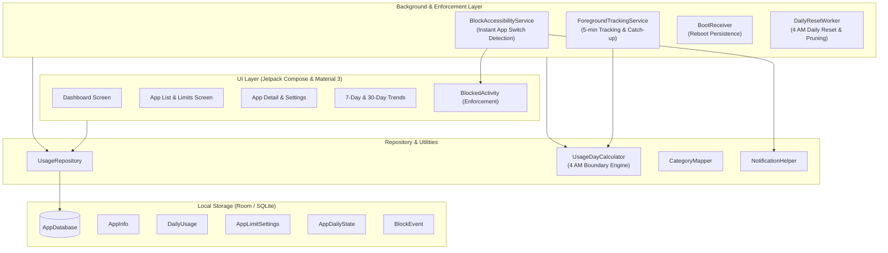

# SyncOn

<div align="center">

[](LICENSE)
[-brightgreen.svg)](https://developer.android.com)
[](https://developer.android.com)
[](https://kotlinlang.org)
[](https://developer.android.com/jetpack/compose)
[](#privacy--zero-network-guarantee)

**A high-precision, offline-first personal digital wellbeing and app limit enforcement system for Android.**

[Features](#key-features) • [Architecture](#architecture) • [Usage-Day Logic](#usage-day-definition-400-am---400-am) • [Permissions](#permissions--setup) • [Getting Started](#getting-started) • [License](#license)

</div>

---

## Overview

**SyncOn** is an advanced, standalone Android application designed to give you uncompromising control over your screen time. While standard digital wellbeing tools provide passive observation, SyncOn enforces proactive, granular boundaries tailored to your daily schedule:

- **100% Offline & Private:** Built with zero network permissions. Your personal usage data never leaves your device.
- **Custom Usage Days:** Evaluates your day on a **4:00 AM to 4:00 AM** boundary—late night activity counts toward your actual awake period, not an arbitrary midnight reset.
- **Strict vs. Soft Blocking:** Enforce ironclad limits on distraction apps while maintaining flexible snoozes for work and utility tools.
- **Data Gap Reconciliation:** Never loses usage history across reboots or background kills by reconciling with Android's system event log.

---

## Key Features

### ⏱️ High-Precision Tracking & Gap Reconciliation
- Tracks active foreground duration across all installed applications via `UsageStatsManager`.
- Updates counters in ~5-minute granular intervals using a persistent `ForegroundTrackingService`.
- **Automatic Gap Catch-up:** Even if killed by aggressive OEM battery managers or across system reboots, SyncOn catches up on missed events using historical timestamps upon wake-up.

### 🛡️ Dual-Tier Enforcement (Strict vs. Soft)
Configure each application with an independent daily limit:
- 🔴 **STRICT Mode:** Once the limit is exhausted, access is immediately blocked. A dedicated, non-dismissible `BlockedActivity` prevents usage until the 4:00 AM reset.
- 🟡 **SOFT Mode:** When blocked, a **"Snooze (+N mins)"** button allows temporary extension while auditing each snooze event into the database.

### 🔔 Smart Advance Warnings
- Fires a heads-up notification when remaining time drops to or below the warning threshold (default 5 minutes), preventing unexpected interruptions.

### 🌅 4:00 AM – 4:00 AM Usage-Day Boundary
- Standard calendar days reset at midnight. SyncOn uses a unified `UsageDayCalculator` ensuring usage at 1:30 AM is attributed to the previous day's counters.

### 🏷️ Intelligent App Categorization
- Automatically assigns categories (Social Media, Entertainment, Communication, Productivity, etc.) upon first detection.
- Full manual override support: user-defined category tags are locked and permanently respected.

### 📊 Trends & Long-Term Analytics
- **Today's Breakdown:** Instant visibility into top apps, category distribution, and remaining budgets.
- **7-Day & 30-Day Trends:** Interactive Jetpack Compose bar charts and summaries.
- **3-Year Retention:** Retains up to 1,095 days of indexed daily usage history with automated background pruning via `WorkManager`.

---

## Privacy & Zero-Network Guarantee

SyncOn is built from the ground up for absolute privacy:
- 🚫 **No `android.permission.INTERNET` declared** anywhere in the manifest.
- 🚫 No analytics, crash reporters, telemetry, cloud databases, or third-party ads.
- 💾 All data is stored strictly on-device in a local Room (SQLite) database.

---

## Architecture

SyncOn follows modern Android Clean Architecture principles, leveraging Jetpack Compose for declarative UI, Coroutines/Flow for asynchronous data streams, and Room for persistence.



---

## Tech Stack

| Component | Technology | Description |
|---|---|---|
| **Language** | [Kotlin 2.4](https://kotlinlang.org) | Modern idiomatic Kotlin with coroutines |
| **UI Toolkit** | [Jetpack Compose (BOM 2026.03)](https://developer.android.com/jetpack/compose) | Declarative UI with Material Design 3 |
| **Persistence** | [Room 2.8](https://developer.android.com/training/data-storage/room) | SQLite abstraction layer with KSP code generation |
| **Background Work** | [WorkManager 2.10](https://developer.android.com/topic/libraries/architecture/workmanager) | Periodic 4 AM maintenance and retention cleanup |
| **System APIs** | `UsageStatsManager`, `AccessibilityService` | Real-time usage event monitoring and foreground detection |
| **Tooling & Build** | Android Gradle Plugin 9.3, Gradle 9.7, Java 21 | Version catalog (`libs.versions.toml`) |

---

## Usage-Day Definition (4:00 AM - 4:00 AM)

SyncOn centralizes all date boundary calculations into `UsageDayCalculator`:

```
localDateTime = convert(timestamp, deviceTimeZone)
if localDateTime.hour < 4:
    return localDateTime.date - 1 day
else:
    return localDateTime.date
```

All queries for "today's usage", daily limits, warning states, and historical charts run against this usage-day key (`YYYY-MM-DD`).

---

## Permissions & Setup

To deliver automated tracking and enforcement without root access, SyncOn requests three specialized Android permissions during onboarding:

1. **Usage Access (`PACKAGE_USAGE_STATS`)**:
   - Enables querying `UsageStatsManager` for foreground app session times.
2. **Accessibility Service (`BlockAccessibilityService`)**:
   - Detects `TYPE_WINDOW_STATE_CHANGED` events to instantly trigger `BlockedActivity` when an over-limit app is launched.
3. **Battery Optimization Exemption (`REQUEST_IGNORE_BATTERY_OPTIMIZATIONS`)**:
   - Ensures the foreground tracking loop runs consistently without being killed during device sleep.
4. **Boot Completed (`RECEIVE_BOOT_COMPLETED`)**:
   - Automatically restarts the tracking service whenever the device restarts.

---

## Project Structure

```
com.yu.syncon/
├── data/
│   ├── local/
│   │   ├── dao/             # Room DAOs (DailyUsage, AppInfo, Limits, etc.)
│   │   ├── entity/          # Room @Entity schemas
│   │   └── AppDatabase.kt   # Database configuration & type converters
│   └── repository/          # UsageRepository (data access abstraction)
├── service/
│   ├── accessibility/       # BlockAccessibilityService (real-time blocking)
│   ├── receiver/            # BootReceiver (boot listener)
│   ├── tracking/            # ForegroundTrackingService (tracking loop)
│   └── worker/              # DailyResetWorker (4 AM maintenance)
├── ui/
│   ├── appdetail/           # Per-app limit configuration
│   ├── applist/             # Installed apps with category filters
│   ├── blocked/             # Fullscreen blocking overlay screen
│   ├── components/          # Reusable Compose charts and controls
│   ├── dashboard/           # Today's metrics and summary
│   ├── navigation/          # Compose Navigation routes
│   ├── onboarding/          # Step-by-step permissions flow
│   ├── settings/            # App settings and permission status
│   ├── theme/               # Material 3 colors, typography, shapes
│   └── trends/              # 7-day and 30-day analytics charts
└── util/
    ├── CategoryMapper.kt    # Default category mapping
    ├── NotificationHelper.kt# Heads-up limit warning notifications
    ├── PermissionUtils.kt   # App-ops and permission checkers
    └── UsageDayCalculator.kt# 4 AM boundary calculation engine
```

---

## Getting Started

### Prerequisites
- **Android Studio** Ladybug (or Antigravity IDE)
- **JDK 21**
- **Android Device or Emulator** running **Android 12 (API level 31)** or higher

### Build & Run

1. **Clone the repository:**
   ```bash
   git clone https://github.com/yushy07/syncon.git
   cd syncon
   ```

2. **Build Debug APK:**
   ```bash
   ./gradlew assembleDebug
   ```

3. **Run Unit Tests:**
   ```bash
   ./gradlew test
   ```

4. **Install on connected device via ADB:**
   ```bash
   ./gradlew installDebug
   ```

---

## License

This project is licensed under the **Apache License, Version 2.0**.

```
Copyright 2026 Ayush Kant

Licensed under the Apache License, Version 2.0 (the "License");
you may not use this file except in compliance with the License.
You may obtain a copy of the License at

    http://www.apache.org/licenses/LICENSE-2.0

Unless required by applicable law or agreed to in writing, software
distributed under the License is distributed on an "AS IS" BASIS,
WITHOUT WARRANTIES OR CONDITIONS OF ANY KIND, either express or implied.
See the License for the specific language governing permissions and
limitations under the License.
```
