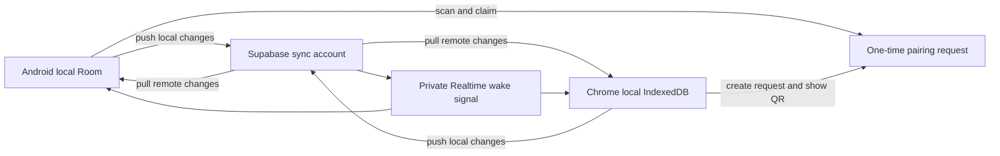
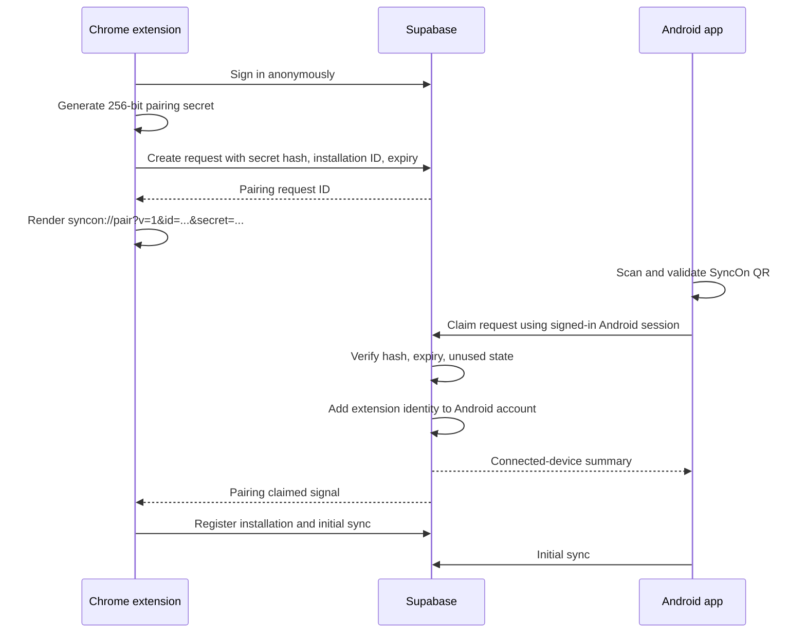

# SyncOn Connected Product Roadmap

Status date: 2026-09-20  
Scope: Android app + Chrome extension + Supabase + QR pairing + shared product design  
Implementation rule: local tracking and blocking must continue even when authentication, Supabase, or another device is unavailable.

## 1. Final product outcome

SyncOn becomes one connected digital-wellbeing product with two local-first clients:

- The Android app tracks Android applications and remains the primary account and device-management surface.
- The Chrome extension tracks focused domain usage and remains usable without pairing.
- Supabase synchronizes immutable activity intervals, settings, categories, block events, device membership, and cursors.
- A newly installed extension opens a first-run page with a one-time QR code.
- The Android app scans the QR, confirms the computer, and securely connects the extension to the same SyncOn account.
- Both clients show Android, Chrome, and combined totals without mixing remote data into the wrong local enforcement calculation.
- The extension uses the same visual language, copy style, component shapes, colors, and interaction quality as the Android app.

## 2. Non-negotiable product rules

1. Local recording happens before network upload.
2. Tracking and local limits never depend on Supabase availability.
3. The QR never contains a password, Supabase access token, refresh token, publishable key, service-role key, email address, or usage history.
4. Pairing requests expire after 10 minutes and can be used once.
5. Pairing secrets are stored only as hashes on the backend.
6. Every cloud record is protected by account-membership Row Level Security.
7. The service-role key exists only in trusted Supabase server infrastructure, never in either client.
8. Remote Android/Chrome intervals are cached separately from locally recorded intervals.
9. Raw Android packages and Chrome domains remain unchanged; logical-service mappings are enrichment only.
10. Combined reports show both summed device time and overlap-adjusted active digital span.
11. Unpairing stops future synchronization but does not silently delete local history.
12. Existing local users can continue without creating an account.

## 3. Current implementation baseline

### Already present

- Android foreground tracking, gap reconciliation, 4 AM usage day, app/category limits, blocking, snoozing, local Room storage, stable installation ID, sync metadata, and backup import/export.
- Chrome active-tab tracking, idle/focus handling, domain/category limits, blocking, local IndexedDB intervals, service-worker recovery, stable installation ID, and backup import/export.
- Shared activity contract, service mappings, cross-platform time policy, and stable setting revisions.
- Supabase migration draft with user-owned activity/settings tables, revision-based push/pull RPCs, RLS, summaries, and Realtime publication.

### Not yet present

- The Supabase migration has not been confirmed as deployed to the live project.
- The current schema owns records directly by `user_id`; it does not yet support an anonymous extension identity joining a permanent Android account.
- Neither client contains Supabase configuration, authentication, token refresh, upload/download, Realtime wake-up, or device management.
- Android has no SyncOn account UI or QR scanner.
- The extension has no first-run onboarding or pairing UI.
- Extension design tokens currently approximate, rather than exactly match, the Android design system.

## 4. Target architecture



Supabase Realtime is only a wake-up signal. After a signal, the client calls the cursor-based pull RPC. This prevents dropped WebSocket events from becoming lost data and keeps one synchronization path authoritative.

## 5. Secure QR pairing flow



### QR payload

Use a strict versioned URI:

```text
syncon://pair?v=1&id=<request-uuid>&secret=<base64url-256-bit-secret>
```

The scanner accepts only the `syncon` scheme, `pair` host, supported version, UUID-shaped request ID, and correctly sized secret. Unknown parameters are ignored; malformed payloads never reach the backend.

### First-install extension states

1. **Preparing SyncOn** — create/restore anonymous session and installation.
2. **Connect your phone** — large QR, expiry countdown, short privacy explanation.
3. **Waiting for approval** — refresh status through Realtime plus bounded polling fallback.
4. **Connected** — show Android device name and begin initial two-way sync.
5. **Continue locally** — skip pairing without losing any extension feature.
6. **Expired** — generate a new request and invalidate the old one.
7. **Error/retry** — explain offline, backend, or configuration problems without clearing local data.

## 6. Supabase data model changes

The existing v1 schema must be audited live before modification. If migration v1 was never applied, replace its ownership model before the first deployment. If it was applied, add a forward-only v2 migration that preserves all rows.

### New account tables

#### `sync_accounts`

- `account_id uuid primary key`
- `owner_user_id uuid references auth.users`
- `display_name text`
- `created_at`, `updated_at`

#### `sync_account_members`

- `account_id`
- `auth_user_id`
- `member_type`: `OWNER`, `ANDROID_DEVICE`, `CHROME_DEVICE`
- `installation_id`
- `joined_at`, `last_seen_at`, `revoked_at`
- Unique membership by account and authenticated identity.

#### `pairing_requests`

- `request_id uuid primary key`
- `requester_user_id`: anonymous extension Auth user
- `installation_id`
- `secret_hash`
- `expires_at`
- `claimed_at`
- `claimed_by_user_id`
- `account_id`
- `attempt_count`
- `created_at`

No raw pairing secret is stored.

### Existing sync tables

Add `account_id` to installations, activity intervals, source metadata, limits, block events, and source mappings. Preserve the source installation and creator identity for auditing, but authorize by account membership.

Primary uniqueness becomes account-scoped:

- Activity: `(account_id, record_id)`
- Settings: `(account_id, record_id)`
- Sources: `(account_id, source_type, source_identifier)`
- Installations: `(account_id, installation_id)`

### RLS helpers

Create stable, security-definer membership helpers with fixed search paths:

- `syncon_current_account_id()`
- `syncon_is_account_member(account_id)`
- `syncon_is_permanent_user()`
- `syncon_can_manage_devices(account_id)`

Owners can view, add, and revoke devices. Anonymous extension identities can read/write sync data for their joined account but cannot add members, claim pairings, rename the account, or revoke the owner.

### Pairing RPCs

- `create_pairing_request_v1(installation_id, secret_hash, client_version)`
- `get_pairing_status_v1(request_id)`
- `claim_pairing_request_v1(request_id, secret, android_installation_id)`
- `cancel_pairing_request_v1(request_id)`
- `list_connected_installations_v1()`
- `revoke_installation_v1(installation_id)`

Every pairing RPC validates authentication type, membership, expiration, one-time use, request ownership, and attempt limits.

### Sync RPC improvements

- Derive `account_id` from the authenticated membership; never trust an account/user ID supplied by a client.
- Preserve idempotent interval uploads by stable record ID.
- Add `base_server_revision` for setting mutations and return conflicts instead of silently accepting stale writes.
- Return per-record acknowledgements so clients mark only accepted rows as synced.
- Pull by durable server-revision cursor.
- Keep tombstones until every active installation has advanced beyond them or a retention window expires.
- Add installation heartbeat and last-successful-sync fields.

### Realtime design

Use private account-scoped Broadcast topics such as `account:<account-id>`. Database triggers publish a small `sync_changed` message containing only the newest server revision and changed collection name. No usage payload is broadcast.

### Backend abuse and cleanup

- Enable anonymous Auth only when pairing RPC/RLS restrictions are deployed.
- Apply anonymous-sign-in rate limits and bot protection before public release.
- Limit one active pairing request per extension installation.
- Limit claim attempts and invalidate a request after repeated failures.
- Scheduled cleanup deletes expired pairing requests and abandoned anonymous identities when safe.
- Log pairing creation, claim, expiry, revocation, and suspicious retries without storing the raw secret.

## 7. Android workstream

### 7.1 Backend configuration

- Add `INTERNET` permission.
- Read Supabase URL and publishable key from developer/build configuration.
- Ensure release builds fail clearly if production backend configuration is missing.
- Never commit service-role credentials.

### 7.2 Authentication

Add a permanent SyncOn account flow using email OTP/magic link as the default, with session refresh and sign-out. Local-only mode remains the initial state and does not block tracking.

Required components:

- `BackendConfig`
- `AuthRepository`
- encrypted session storage
- account/session state flow
- token refresh and expired-session recovery
- account deletion/sign-out handling

### 7.3 Room migration

Add a new Room version containing:

- `remote_usage_interval` for Chrome/other-device analytics
- `sync_cursor`
- `connected_installation_cache`
- `sync_conflict`
- upload-attempt metadata/backoff timestamps

Do not insert Chrome intervals into Android's local enforcement tables. Existing app-limit queries must continue to count Android-local usage only.

### 7.4 Android sync engine

- Register Android installation after sign-in.
- Push pending local intervals in bounded batches.
- Push app/category settings, source metadata, mappings, and block events.
- Pull until `has_more` is false, apply each page transactionally, then persist the cursor.
- Mark only acknowledged records as synced.
- Retry with exponential backoff and network constraints.
- Trigger sync after sign-in, app resume, meaningful local change, successful pairing, Realtime signal, and periodic background work.
- Keep local tracking/enforcement independent from sync failures.

### 7.5 QR scanner and pairing UI

Use Google Code Scanner for a permission-light QR flow. Add:

- Settings → **Connected devices**
- **Connect Chrome extension** action
- scanner launch
- parsed-code confirmation screen showing the requesting computer/extension installation
- connecting, success, expired, already-used, invalid-code, and offline states
- connected-device list with platform, name, last sync, and revoke action

Revocation requires an explicit confirmation and immediately invalidates future cloud access for that installation.

### 7.6 Combined Android dashboard

Add an `All / Android / Chrome` selector to Today and Trends.

- Android view uses local Android records.
- Chrome view uses the remote cache.
- All view exposes both `Summed device time` and `Active digital span`.
- Each row keeps its source/platform badge.
- Unknown remote sources remain visible rather than being discarded.
- Dashboard refresh never blocks the local UI while syncing.

### 7.7 Shared limits

- Sync `SOURCE` and `CATEGORY` limits between matching clients.
- Add `LOGICAL_SERVICE` and `ACCOUNT` targets only after cross-platform totals are stable.
- Clearly label cross-platform enforcement as connectivity-dependent.
- If offline, enforce the last durable local state and show that shared usage may be delayed.

## 8. Chrome extension workstream

### 8.1 Backend foundation

- Add only the Supabase project host to `host_permissions`.
- Bundle the Supabase client or implement the small Auth/RPC surface locally; never load remote JavaScript under Manifest V3.
- Store the anonymous session in extension-owned storage.
- Refresh sessions before expiry.
- Register the Chrome installation after pairing.
- Add a named sync alarm plus sync-on-worker-wake.

### 8.2 IndexedDB upgrade

Upgrade the extension database with separate stores for:

- locally recorded Chrome intervals
- remote Android/other-device interval cache
- sync cursor and acknowledgements
- conflicts and retry state

Local Chrome enforcement continues to use only Chrome-local totals.

### 8.3 First-run onboarding

On `runtime.onInstalled` with reason `install`, open `onboarding/onboarding.html`.

New files:

- `extension/onboarding/onboarding.html`
- `extension/onboarding/onboarding.css`
- `extension/onboarding/onboarding.js`
- locally bundled QR encoder

The page creates an anonymous Supabase user, generates a request and secret, displays the QR, shows expiry, supports refresh, and allows local-only continuation.

An extension update must never reopen onboarding automatically. A manual **Connect another phone** entry can reopen it from Settings.

### 8.4 Extension sync engine

- Complete/commit the active browser interval before each upload.
- Upload pending Chrome intervals and state in batches.
- Pull remote changes by cursor and cache Android intervals separately.
- Rebuild only derived remote/combined summaries after pull.
- Resolve setting conflicts explicitly.
- Wake on account Broadcast, alarm, startup, dashboard open, and manual sync.
- Treat service-worker suspension as normal; all sync progress is durable.

### 8.5 Extension connected states

The popup and dashboard show one of:

- Local only
- Waiting for phone
- Connected and synced
- Syncing
- Offline—changes saved locally
- Action required/session expired
- Device revoked

Never show “synced” based only on a network request starting; use the last acknowledged server revision/time.

## 9. Extension design parity

The extension should feel like the same product, not a separate purple web dashboard.

### Exact shared tokens

| Token | Android | Extension target |
|---|---:|---:|
| Warm background | `#FBF9F5` | `#FBF9F5` |
| Card surface | `#FFFFFF` | `#FFFFFF` |
| Card border | `#EDE8E1` | `#EDE8E1` |
| Primary indigo | `#4F67E0` | `#4F67E0` |
| Primary hover | `#3B53CC` | `#3B53CC` |
| Primary light | `#EDF0FD` | `#EDF0FD` |
| Text primary | `#1A1C1E` | `#1A1C1E` |
| Text secondary | `#75777E` | `#75777E` |
| Coral | `#E06D53` | `#E06D53` |
| Sage | `#3E6B5C` | `#3E6B5C` |
| Amber | `#E8A838` | `#E8A838` |

### Shared component language

- 20 px cards, 24 px hero cards, fully rounded primary actions.
- Use the actual SyncOn sprout mark instead of the letter `S` placeholder.
- Use the Android type hierarchy: strong 28/22 px headings, 18/16 px card titles, calm 15/13 px body copy.
- Remove the extension's heavy generic shadow; use restrained borders and soft elevation.
- Match Android category colors and badges.
- Use the same copy tone: short, calm, factual, and non-punitive.
- Preserve keyboard focus, reduced motion, semantic labels, contrast, and zoom support.

### Popup layout

1. SyncOn brand + connected/sync state.
2. Today hero with total and active website.
3. `All / Chrome` compact toggle when paired.
4. Top websites or combined sources.
5. Remaining-limit card when relevant.
6. Pause/resume and open-dashboard actions.

### Dashboard navigation

- Today
- Sources (Android apps + Chrome websites with filters)
- Limits
- Trends
- Connected devices
- Settings

The information architecture mirrors Android even when controls are adapted for desktop width.

### Onboarding visual direction

- Left side: SyncOn promise, three privacy assurances, local-only option.
- Right side: calm device-connection card containing QR, countdown, and three-step instructions.
- Connected state transitions to a simple confirmation, not a confetti-heavy flow.
- Mobile/narrow layouts stack vertically.

## 10. Initial synchronization behavior

After pairing:

1. Both clients finish and commit active local sessions.
2. Each registers its installation.
3. Each uploads unsynced intervals and state in bounded batches.
4. Backend deduplicates by account and stable record ID.
5. Each pulls from revision zero into the remote cache.
6. Each computes derived summaries locally.
7. Cursors are stored only after transactional application.
8. Realtime subscriptions start after the first successful pull.
9. UI changes to Connected only after membership and initial pull succeed.

For a large existing history, show determinate batch progress and allow the user to close the page; synchronization resumes later.

## 11. Conflict and failure policy

### Activity intervals

- Append-only and idempotent.
- Higher local revision may correct/tombstone the same record.
- Never replace one record with an unrelated last-write-wins interval.

### Settings and categories

- Mutations include `base_server_revision`.
- Matching base: accept and assign the next server revision.
- Stale base: return the current server record as a conflict.
- Automatic background conflict policy keeps the latest server-accepted record; Settings exposes rare unresolved conflicts.

### Failure handling

- Network failure: keep pending locally and back off.
- Expired access token: refresh once, then require reconnect/sign-in.
- Revoked device: stop cloud calls and preserve local tracking.
- Partial page application: rollback locally and keep the previous cursor.
- Duplicate upload: acknowledge existing record without double-counting.
- Clock skew: server revision orders sync; device timestamps remain activity facts, not conflict authority.

## 12. Ordered implementation phases

### Phase 0 — Live-state audit and contract freeze

- Refresh the task so Supabase MCP tools are available.
- Inspect live migration history, Auth settings, tables, policies, functions, publications, and project client configuration.
- Confirm whether backend v1 was deployed.
- Freeze pairing/account v2 SQL and client JSON contracts.

**Gate:** live and repository state are reconciled; no destructive migration assumption remains.

### Phase 1 — Account membership and pairing backend

- Add account/member/pairing tables.
- Migrate ownership to account scope.
- Implement pairing/device RPCs and RLS.
- Enable anonymous Auth only after policies exist.
- Add expiry, retry limits, cleanup, and audit logging.

**Gate:** two authenticated test identities can pair through RPCs; an unrelated identity cannot read either account.

### Phase 2 — Production sync backend

- Upgrade push/pull acknowledgements and conflicts.
- Add account-scoped Realtime Broadcast wake signals.
- Verify summary RPCs under membership RLS.
- Apply and verify live through Supabase MCP.

**Gate:** interval deduplication, tombstones, pagination, conflict responses, and RLS work live.

### Phase 3 — Android account foundation

- Add backend config, network permission, Auth repository, secure session storage, and account UI.
- Add local-only/signed-in states.
- Register Android installation.

**Gate:** Android can sign in, refresh, restart, sign out, and remain fully functional offline.

### Phase 4 — Android sync engine

- Add Room migration and remote caches.
- Implement transactional push/pull, cursor, retries, and background scheduling.
- Add combined analytics models.

**Gate:** Android data uploads once, remote Chrome fixtures download without affecting Android enforcement, and restart resumes from the cursor.

### Phase 5 — Extension backend foundation

- Add restricted host permission, local Supabase/Auth client, anonymous session, IndexedDB migration, and sync worker.
- Add backend state messages for UI surfaces.

**Gate:** extension can create/restore its anonymous identity and survive service-worker suspension without losing sync state.

### Phase 6 — QR onboarding and Android claim flow

- Build extension first-run onboarding and QR creation.
- Add Android scanner, confirmation, claim, device list, and revoke.
- Add expiry, refresh, local-only skip, and recovery paths.

**Gate:** clean extension install pairs once; expired/replayed/wrong QR codes fail safely; reinstall creates a distinct device.

### Phase 7 — Initial and ongoing two-way synchronization

- Run initial history merge.
- Add Realtime wake signals plus polling/background fallbacks.
- Sync settings, categories, mappings, events, and tombstones.
- Add last-sync and conflict visibility.

**Gate:** changes made on either client appear on the other, duplicates never alter totals, and offline changes reconcile later.

### Phase 8 — Cross-platform product surfaces

- Add platform selectors and dual totals to Android.
- Add combined views to extension popup/dashboard.
- Add shared source/category limits, then logical/account limits.

**Gate:** Android, Chrome, and combined views agree for the same backend snapshot.

### Phase 9 — Extension visual rebuild

- Replace CSS tokens and placeholder branding.
- Rebuild popup, dashboard, onboarding, blocked page, dialogs, empty/error/loading states.
- Match Android component hierarchy and accessibility behavior.

**Gate:** side-by-side review reads as one design system at popup, tablet-width, and desktop-width layouts.

### Phase 10 — Privacy, resilience, and release hardening

- Add anonymous-auth abuse controls.
- Verify session/token handling and no-secret packaging.
- Add device revocation, account deletion, retention, observability, and diagnostic export.
- Prepare Chrome Web Store disclosures and Android privacy/data-safety declarations.

**Gate:** security checklist, recovery scenarios, policy copy, and production configuration are complete.

### Phase 11 — End-to-end validation and release

- Fresh Android install + fresh extension install.
- Pair, initial merge, restart, sleep/wake, process death, offline edits, reconnect, revoke, reinstall, and large-history checks.
- Verify combined totals and shared-limit behavior with simultaneous usage.
- Build signed Android release and packaged extension only after all gates pass.

**Gate:** release candidate is reproducible and no completion claim relies only on unit tests or static inspection.

## 13. File-level implementation map

### Supabase

- `supabase/migrations/*_account_pairing_v2.sql`
- `supabase/migrations/*_sync_conflicts_realtime_v3.sql`
- `supabase/API_CONTRACT.md`
- `supabase/README.md`
- Optional Edge Functions only if database RPCs cannot safely provide abuse controls.

### Android

- `data/remote/BackendConfig.kt`
- `data/remote/SupabaseHttpClient.kt`
- `data/repository/AuthRepository.kt`
- `data/repository/CloudSyncRepository.kt`
- `data/repository/PairingRepository.kt`
- new Room entities/DAOs for remote cache, cursor, installations, conflicts
- `service/worker/CloudSyncWorker.kt`
- `ui/account/AccountScreen.kt`
- `ui/devices/ConnectedDevicesScreen.kt`
- `ui/devices/PairExtensionScreen.kt`
- dashboard/trends/settings integration
- `SyncOnApp.kt`, `MainActivity.kt`, manifest, Gradle catalog/build configuration

### Extension

- `extension/lib/backend-config.js`
- `extension/lib/supabase-client.js`
- `extension/lib/sync.js`
- IndexedDB v2 changes in `extension/lib/db.js`
- onboarding folder and bundled QR encoder
- service-worker pairing/sync message handling
- popup/dashboard/blocked-page parity updates
- manifest host permission and packaged resources

### Shared

- `shared/pairing-contract-v1.md`
- `shared/sync-contract-v2.md`
- design token JSON/CSS source shared with extension
- updated cross-platform enforcement policy

## 14. Small commit and push sequence

1. `docs: define secure QR pairing and connected product plan`
2. `feat(backend): add sync accounts and one-time pairing`
3. `feat(backend): harden sync conflicts and realtime wakeups`
4. `feat(android): add SyncOn account foundation`
5. `feat(android): add durable cloud sync engine`
6. `feat(extension): add anonymous backend session and sync storage`
7. `feat(pairing): connect Chrome through Android QR scan`
8. `feat(sync): synchronize activity settings and device state`
9. `feat(android): add combined cross-platform insights`
10. `feat(extension): align interface with Android design system`
11. `chore: harden privacy recovery and release configuration`

Each phase is built/checked before its commit, pushed immediately, and reported with its exact hash. Live Supabase deployment evidence is reported separately from repository commits.

## 15. Definition of done

The connected product is complete only when all statements below are true:

- A fresh extension install automatically opens SyncOn onboarding.
- The QR contains only a one-time request ID and random secret.
- Android can scan, inspect, approve, and revoke a Chrome installation.
- Reusing or guessing a QR cannot join an account.
- Both clients keep tracking while offline.
- Existing local history uploads once and never duplicates.
- Both clients can pull the other platform's activity and show correct combined totals.
- Local enforcement does not accidentally count remote intervals.
- Settings/categories synchronize with explicit conflict handling.
- Realtime wakes clients, while cursor pull remains authoritative.
- Unpairing blocks future cloud access without erasing local history.
- Extension popup, dashboard, onboarding, and blocked page match Android design tokens and interaction style.
- No service-role credential, reusable login credential, or raw pairing secret is shipped or logged.
- Live Supabase RLS, RPCs, publications, Auth settings, and cleanup behavior are verified—not merely present in SQL files.
- Android and extension release builds pass their final runtime and store-policy checks.

## 16. Explicitly excluded from this roadmap

- iOS, Safari, Firefox, Edge-specific packaging, and native desktop tracking.
- Full URL, page-content, keystroke, form, or search-query collection.
- Employer, parental-surveillance, or multi-tenant organization dashboards.
- Any QR flow that copies a phone session token into the extension.

## 17. Implementation starting point

Begin with Phase 0. Do not wire client authentication to the current user-owned schema first and then retrofit pairing; account membership must be the backend foundation before either client sends production data.

## 18. Official implementation references

- [Supabase anonymous sign-ins](https://supabase.com/docs/guides/auth/auth-anonymous)
- [Supabase Realtime database changes](https://supabase.com/docs/guides/realtime/subscribing-to-database-changes)
- [Chrome extension first-install onboarding tabs](https://developer.chrome.com/docs/extensions/reference/api/tabs)
- [Google Code Scanner for Android](https://developers.google.com/ml-kit/vision/barcode-scanning/code-scanner)
